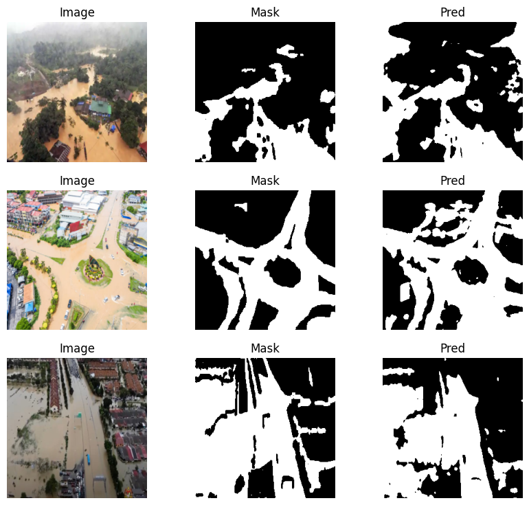

# 🌊 Flood Segmentation using U-Net

This project implements a **U-Net deep learning model** for detecting flooded regions from aerial/satellite images.

## 🚀 Features
- Custom PyTorch Dataset class for image + mask pairs
- U-Net architecture with **BCE + Dice Loss**
- Evaluation metrics: IoU, Dice coefficient
- Automatic checkpoint saving & early stopping
- Training on Google Colab with GPU acceleration
- Visualization of predicted flood masks

## 📂 Project Structure
- `src/dataset.py` – Dataset loader  
- `src/model.py` – U-Net architecture  
- `src/loss_metrics.py` – Loss & metrics  
- `src/train.py` – Training loop, checkpointing, visualization  
- `results/` – Example predictions  

## Results
| Input Image | Ground Truth | Predicted Flood Mask |
|-------------|--------------|-----------------------|
| 

## ⚙️ Installation
```bash
pip install -r requirements.txt

